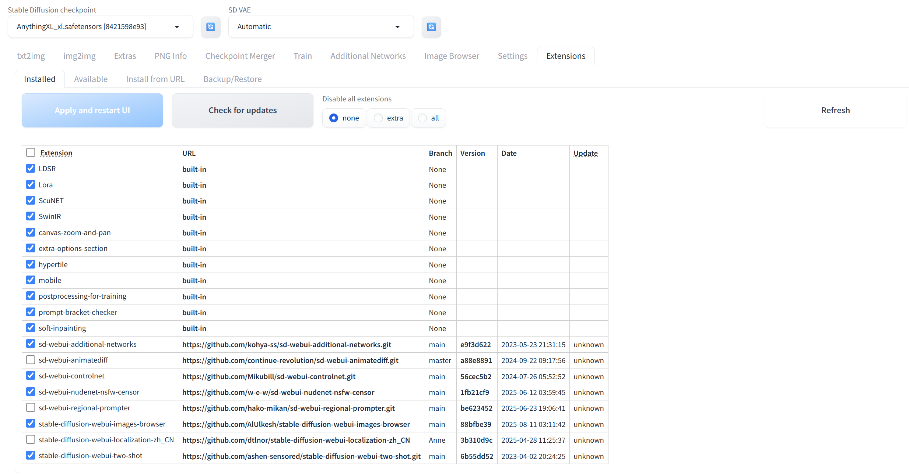
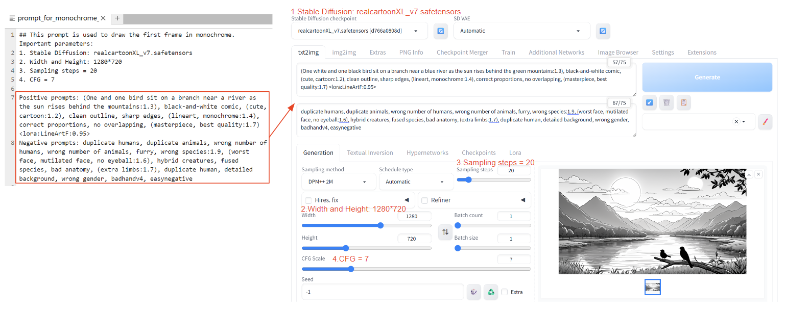
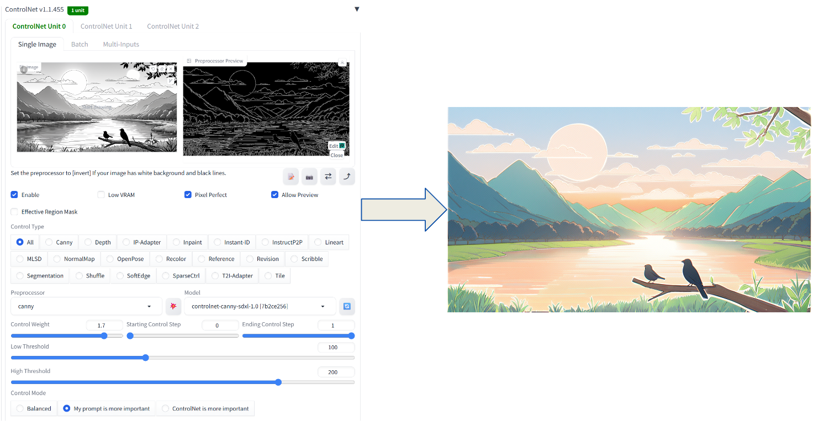

您好！本文件中记录了详细的项目环境配置，以及完整的项目流程介绍！
如果在配置中出现了任何不理解或者问题，请联系该邮箱：**hxia0469@uni.sydney.edu.au**


## 环境配置
### Stable Diffusion WebUI环境配置
#### 1. 基本介绍 
Stable Diffusion WebUI（后面简称WebUI），是一个集成式的开源平台，通过调用各种API（Stable Diffusion，ControlNet，LoRA等）来实现AI生图。
在本次项目中，WebUI会根据您的输入生成第一帧的画面，作为Anisora的首帧参考图。需要注意的是，您需要自行下载开源代码并且将它部署在本地（或云端），
并且不需要将WebUI项目和Anisora项目放置在同一个目录，或者配置完全相同的环境。

#### 2. 下载方法
该项目对于电脑显卡的要求比较低。我们小组在RTX4090上就能够运行。显卡越好，运算速度越快。该项目有两种下载方法：

##### 百度网盘
解压缩该压缩包，您能够直接获得WebUI的核心功能组件、必备模型、中文本地化补丁和图库浏览器。请注意！此压缩包只能够在NVDIA卡驱动的电脑上使用。链接如下：

通过网盘分享的文件：sd.webui.zip

链接: https://pan.baidu.com/s/1czxmteAh9Dc0EVagOKa72g?pwd=p8dp 提取码: p8dp

##### 项目GitHub仓库
如果百度网盘的文件产生了报错，或者您的电脑不是NVDIA卡驱动，或者各种各样的其他原因，导致您无法安装WebUI，那么请前往WebUI作者的项目仓库自行配置。
这种方法能够在任何环境下进行安装WebUI。

项目仓库：https://github.com/AUTOMATIC1111/stable-diffusion-webui

安装说明：https://github.com/AUTOMATIC1111/stable-diffusion-webui/wiki/Install-and-Run-on-NVidia-GPUs

#### 3. 必要插件下载
1) 当您配置好项目的基础环境之后，您还需要下载一些必要的功能型插件以及项目必要的模型。
下图中我勾选的扩展名请全部下载（我忘记哪些是真正有用的了。。保险起见请下载所有勾选的扩展）。
这些扩展您可以直接在WebUI的Extension模块下载（WebUI->Extension->点击Load From->搜索扩展并下载即可）。
<p align="center">
  
  <br>
</p>

2) 您还需要下载2种项目中必要的Stable Diffusion模型，并放置在“./webui/Stable-diffusion”中。

文件名1: AnythingXL_xl.safetensors --下载地址: https://civitai.com/models/9409?modelVersionId=384264

文件名2: realcartoonXL_v7.safetensors --下载地址: https://civitai.com/models/125907/realcartoon-xl

3) 您还需要下载1种项目中必要的LoRA模型，并放置在“./webui/Lora”中。

文件名: LineArtF.safetensors --下载地址: https://civitai.com/models/596934/line-art-style-sdxl-pony

4) 您还需要下载2种项目中必要的Embeddings模型，并放置在“./webui/embeddings”中。下载地址如下：

文件名1: badhandv4.pt --下载地址: https://civitai.com/models/16993/badhandv4

文件名2: easynegative.safetensors --下载地址: https://civitai.com/models/7808/easynegative

5) 您还需要下载1种项目中必要的ControlNet模型，并放置在“./webui/ControlNet”中。下载地址如下：

文件名: controlnet-canny-sdxl-1.0.safetensors --下载地址: https://huggingface.co/stabilityai/stable-diffusion-xl-base-1.0/tree/main (只需要下载controlnet-canny-sdxl-1.0.safetensors即可)

请注意，由于项目时间并不充足，导致我们组没有充分时间体验更多的WebUI功能，以及充分体验现有功能，导致生成的第一帧图片的质量并非完美。
你们组在今后可以随意下载更多的模型，使用更多的功能，以追求更高的第一帧质量。

### Anisora环境配置
#### 1. 基本介绍 
Anisora是一个开源的视频生成代码。我们小组研究了它，并且基于您的输入，对该项目进行了一系列的魔改。Anisora本身支持一键生成多种动漫风格的视频镜头。

#### 2. 下载方法
该项目对于显卡的要求较高。刚需1张显存大于80G的显卡（或者多张显卡，我们组尝试的是4张48G显存的显卡），型号随意，只会影响运行速度。
该项目已经部署在该GitHub仓库中，地址如下：https://github.com/megafruit/AnisoraV3.git

您可以简单使用以下命令来克隆该仓库：
```bash
git clone https://github.com/megafruit/AnisoraV3.git
```

#### 3. 环境配置方法
执行以下代码，以建立虚拟环境以及配置依赖：
```bash
cd anisoraV3
conda create -n wan_gpu python=3.10
conda activate wan_gpu
pip install -r req-fastvideo.txt
pip install -r requirements.txt
pip install -e .
```
#### 4. 必要模型下载
**flash-attn包**：由于直接pip install这个包往往会导致卡死，因此建议您自己下载该包。这个包能够让程序高效率运行，还是建议去自行下载，随后手动安装。
网址：https://github.com/Dao-AILab/flash-attention/releases
项目目前使用的版本：flash_attn-2.8.3+cu12torch2.4cxx11abiFALSE-cp310-cp310-linux_x86_64.whl
下载完毕后放在项目根目录中即可，随后手动安装：
```bash
pip install flash_attn-2.8.3+cu12torch2.4cxx11abiFALSE-cp310-cp310-linux_x86_64.whl
```

**AnisoraV3 checkpoints**: 请在Huggingface上下载完整的AnisoraV3 checkpoints，并放置在Index-anisora/V3.1中。

下载地址: https://huggingface.co/IndexTeam/Index-anisora/tree/main/V3.1

**AniLines-Anime-Lineart-Extractor的预训练模型**：请在百度网盘上下载我分享的weight，该weight用于从动画中提取线稿。
请将该模型保存在Index-anisora/AniLines-Anime-Lineart-Extractor/weights

通过网盘分享的文件：detail.pth
链接: https://pan.baidu.com/s/1KkY_qXgDUM6yA56x5pSITw?pwd=5ph8 提取码: 5ph8

## 具体运行
具体运行部分的结果与详细操作流程请看演示视频。在README中，我们会着重对命令的作用和参数进行详细解释。

### 0. 在流程开始前，请将您的自然语言文本保存在anisoraV3/data/input_txt/input.txt文件中。

### 1. 将.txt文件转化为对应格式的提示词.txt文件

```bash
python scene_graph_builder.py
```
该命令能够读取目标目录中的.txt文件，并转化为简单结构的JSON格式文件。
```bash
python read_json.py
```
该命令能够读取JSON文件，并且能输出3个提示词文件，格式如下

**1.txt**：
```bash
At the beginning (first 1.5 seconds), <你的场景句1>. 
In the same shot (from 1.5s to 5s), <你的场景句2>. @@data/inference-imgs/1.png&&0
```
1.txt用于指导Anisora的视频生成。其中，“@@data/inference-imgs/1.png&&0”代表了参考图的存放位置和指导时机，也是包含在模板中的。

**prompt_for_monochrome_frame.txt**：此提示词用于绘制单色的第一帧
```bash
重要参数:
1. Stable Diffusion模型选择: realcartoonXL_v7.safetensors
2. 分辨率: 1280*720
3. Sampling steps = 20
4. CFG = 7

正面提示词: (<你的场景句1>:1.3), 
black-and-white comic, (cute, cartoon:1.2), clean outline, sharp edges, (lineart, monochrome:1.4), 
correct proportions, no overlapping, (masterpiece, best quality:1.7) <lora:LineArtF:0.95>
负面提示词: duplicate humans, duplicate animals, wrong number of humans, wrong number of animals, 
furry, wrong species:1.9, (worst face, mutilated face, no eyeball:1.6), hybrid creatures, fused species, 
bad anatomy, (extra limbs:1.7), duplicate human, detailed background, wrong gender, badhandv4, easynegative
```
prompt_for_monochrome_frame.txt用于WebUI端的单色第一帧生成。具体如何使用该提示词模板可以看参考视频或者下一步的演示。
**prompt_for_recoloring.txt**：此提示词用于为单色的第一帧上色
```bash
重要参数:
1. Stable Diffusion模型选择: AnythingXL_xl.safetensorsn
2. 分辨率: 1280*720
3. Sampling steps = 25
4. CFG = 7
5. ControlNet: canny算法, weight=1.7, Starting Control Step=0.0, Ending Control Step=1.0, Control mode=My prompt is more important, Low threshold = 100, High threshold = 200

正面提示词: (<你的场景句1>:0.8), simple style, (simple background:1.2), (clear outline, closed line, clear eyes, best face, best quality:1.5)
负面提示词: no color, (bad eyes, no eyeballs, poorly drawn face, rough face, extra limbs:1.5), (badhandv4, easynegative:1.5)

prompt_for_recoloring.txt用于在WebUI端为单色第一帧上色。具体如何使用该提示词模板可以看参考视频或者下一步的演示。
```

### 2. 使用WebUI（Stable Diffusion）生成单色第一帧+ ControlNet改色之后的第一帧（1.png）
这张图展示了如何在WebUI上配置prompt_for_monochrome_frame.txt的主要参数。
<p align="center">
  
  <br>
</p>

这张图展示了如何在WebUI上配置prompt_for_recoloring.txt的主要参数。注意，重点展示了ControlNet的相关参数，其他部分的配置方法和上图一样。
<p align="center">
  
  <br>
</p>

### 3. 使用Anisora生成视频
我们建议使用单张显卡进行视频生成
```bash
python generate-pi-i2v-any.py \
    --task i2v-14B \
    --size 1280*720 \
    --ckpt_dir Index-anisora/V3.1 \
    --image output_videos_any \
    --prompt data/prompt/1.txt \
    --frame_num 81 \
    --sample_steps 6 \
    --sample_shift 8 \
    --sample_guide_scale 1 \
    --use_prompt_extend \
    --prompt_extend_method local_qwen \
    --prompt_extend_target_lang en \
    --prompt_extend_model QwenVL2.5_7B
```
在这里，

    --task 请保持默认i2v-14B
    --size 可以根据需求调整，但是只接受几种固定比例的大小
    --ckpt_dir 存放AnisoraV3 checkpoints模型的目录
    --image 存放输出视频的目录
    --prompt 作为提示词的1.txt文件所在目录
    --frame_num 生成视频的帧数，由于输出视频固定为每秒16帧，因此要求该参数为16的倍数+1
    --sample_steps 生成视频时每一帧的迭代次数，**请根据需要自行调整以得到最佳质量**
    --sample_shift 生成视频时每一帧相对于上一帧的偏移情况，值越大，帧与帧之间的变化程度越大，**请根据需要自行调整以得到最佳质量**
    --sample_guide_scale 生成视频对于提示词的参考程度，值越大，视频越严格符合提示词的要求，**请根据需要自行调整以得到最佳质量**
    --use_prompt_extend 
    --prompt_extend_method 
    --prompt_extend_target_lang 
    --prompt_extend_model 请保持这四个参数为我们提供的数值即可，或者您可以在执行时删除这四个参数。这四个参数表示启用了提示词扩展模型QwenVL2.5_7B,
    能够丰富原本过于简单的提示词，一般来说能够稳定提升画面质量。


这边也附上多张（4张）显卡的命令，但不作过多解释。如果在多张显卡上运行，则执行下列命令：
```bash
torchrun \
    --nproc_per_node=4 \
    --master_port 43210 generate-pi-i2v-any.py \
    --task i2v-14B \
    --size 1280*720  \
    --ckpt_dir Index-anisora/V3.1 \
    --image output_videos_any \
    --prompt data/prompt/1.txt \
    --dit_fsdp --t5_fsdp \
    --ulysses_size 2 \
    --ring_size 2 \
    --frame_num 81 \
    --sample_steps 6 \
    --sample_shift 8 \
    --sample_guide_scale 1 \
    --use_prompt_extend \
    --prompt_extend_method local_qwen \
    --prompt_extend_target_lang en \
    --prompt_extend_model QwenVL2.5_7B
```


    

